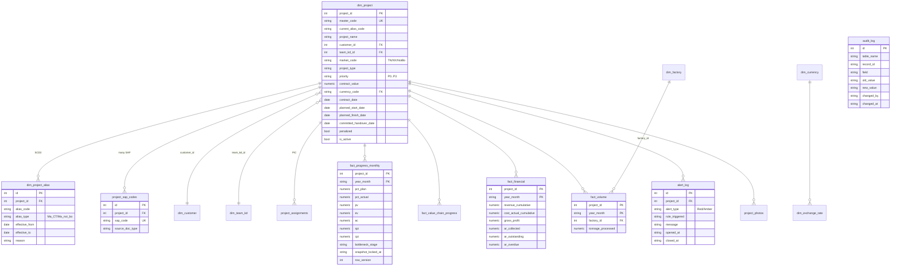
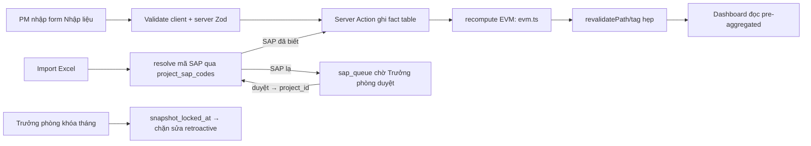

# Data Warehouse — DDC Control Tower

Tài liệu cho Data Engineer/Analyst hiểu lại hệ thống mà không cần đọc toàn bộ code.
**Trạng thái hiện tại:** mock in-memory (`src/server/repo/mock-repo.ts`) mô phỏng đúng schema dưới đây. Khi lên Supabase/Prisma, schema này trở thành `schema.prisma`, các công thức dưới đây chuyển vào `v_project_metrics` (DB view).

---

## 1. ERD (Star Schema)

**Nguyên tắc khóa:** mọi fact JOIN qua `project_id` (surrogate int), KHÔNG qua mã dự án text — vì mã đổi qua các kỳ (`dim_project_alias`) gây gãy trend.

---

## 2. Công thức cột derived (tính ở đâu)

| Cột | Công thức | Nguồn | Nơi tính |
|---|---|---|---|
| `pv` | `%KH × BAC (contract_value)` | fact_progress_monthly | `src/lib/evm.ts` → `calcPv` |
| `ev` | `%TT × BAC` | fact_progress_monthly | `evm.ts` → `calcEv` |
| `spi` | `EV / PV` | — | `evm.ts` → `calcSpi` |
| `cpi` | `EV / AC` | — | `evm.ts` → `calcCpi` |
| `eac` | `BAC / CPI` | — | `evm.ts` → `calcEac` |
| `vac` | `BAC − EAC` | — | `evm.ts` → `calcVac` |
| `sv` / `cv` | `EV − PV` / `EV − AC` | — | `evm.ts` |
| Trạng thái dự án | Chuẩn bị / Đang / Hoàn thành (theo ngày BĐ/KT + %TT) | dim_project + fact | `evm.ts` → `deriveStatus` |
| Đúng/Trễ tiến độ | `%TT ≥ %KH − 5%` → Đúng | — | `evm.ts` → `isOnTrack` |
| Nguy cơ phạt | `(cam kết − hôm nay) ≤ 30 ngày ∧ %TT < 100% ∧ chưa phạt` | — | `evm.ts` → `penaltyState` |
| Khâu nghẽn | Stage đầu tiên (Thiết kế→…→Nghiệm thu) có %HT < 100% | fact_value_chain_progress | `evm.ts` → `findBottleneck` |
| Backlog | `SUM(contract_value)` khi trạng thái = Chuẩn bị | — | `queries.ts` |
| Cảnh báo công nợ | `ar_overdue > 5% × contract_value` | fact_financial | `evm.ts` → `isOverdueWarning` |
| Cảnh báo dồn tải | `tonnage_tháng > 85% × (capacity/12)` | fact_volume | `evm.ts` → `isCapacityWarning` |

**Nơi sửa công thức/ngưỡng (KHÔNG rải rác):**
- Công thức tính → `src/lib/evm.ts`.
- Ngưỡng đánh giá → `src/lib/thresholds.ts` (SPI 0.9, biên 5%, 30 ngày, 85%, 5%, 80%).
- (Khi lên DB thật: `v_project_metrics` view chứa SPI/CPI/EAC/Backlog/trạng thái đã tính sẵn — hiệu năng Overview.)

---

## 3. Quy tắc NULL

| Cột | NULL nghĩa là | Xử lý hiển thị |
|---|---|---|
| `spi`/`cpi`/`eac`/`vac` | chưa đủ dữ liệu (PV/AC = 0) | `—` (KHÔNG mặc định 0) |
| `contract_date`, các `*_date` | chưa nhập | `—` |
| `ar_overdue` | **LỖI** — phải có (mặc định 0) | hiển thị 0, coi là bug nếu null |
| `pct_plan`/`pct_actual` | **LỖI** đối với dự án Đang triển khai | block submit |
| `committed_handover_date` | **LỖI** khi trạng thái = Đang triển khai | block submit (validate) |

Cột tài chính NULL ≠ 0. Công nợ NULL không được hiểu là "công nợ 0".

---

## 4. ETL / Data flow

**Real-time:** Instant-on-submit — Server Action ghi → `revalidatePath` → trang load lại, không WebSocket.

---

## 5. Data lineage (trường chính → dim/fact)

| Nguồn MasterData | Đích | Transform |
|---|---|---|
| Mã dự án (CCM/TCTN) | `dim_project.current_alias_code` + `dim_project_alias` (SCD2) | resolve qua alias |
| Mã SAP | `project_sap_codes.sap_code` | 1-nhiều, không thay thế |
| Tên dự án / Khách hàng / Team KD | `dim_project` + `dim_customer`/`dim_team_kd` | chuẩn hóa |
| Loại hình / Thị trường / Priority | `dim_project` | enum |
| % KH / % TT lũy kế | `fact_progress_monthly.pct_plan/pct_actual` | % ∈ [0, 1.5] |
| AC lũy kế | `fact_progress_monthly.ac` | tỷ VNĐ |
| PV/EV/SPI/CPI/EAC/VAC | derived | tính qua `evm.ts` |
| % HT Shop/Vật tư/… | `fact_value_chain_progress.pct_complete` (theo stage) | map stage |
| Doanh thu / Chi phí / Công nợ | `fact_financial` | lũy kế + kỳ |
| Khối lượng (tấn) | `fact_volume.tonnage_processed` | theo factory |
